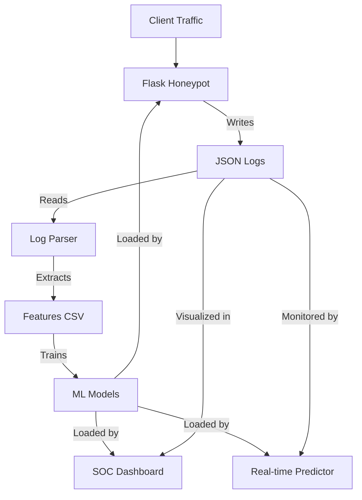

# 🛡️ AI-Powered Honeypot for Intelligent Threat Detection

A **Flask-based cybersecurity honeypot** designed to simulate vulnerable services, capture real-time HTTP traffic, and apply **machine learning models** for automated threat analysis.

The system enables **anomaly detection, attack classification, real-time monitoring**, and **SOC-style visualization**, making it ideal for **blue-team research, SOC training, and academic demonstration**.

> ⚠️ **Lab / Educational Use Only**
> This project must be deployed only inside an **isolated virtual lab or sandbox network**.
> Never expose this honeypot to the public internet.

---

## 🚀 Features

* **Live Traffic Capture** — logs HTTP requests with structured JSON records.
* **Feature Engineering Pipeline** — extracts security-relevant attributes from raw logs (payload length, SQL tokens, etc.).
* **Anomaly Detection** — identifies unknown and suspicious behavior using *Isolation Forest*.
* **Attack Classification** — labels traffic as *Benign, SQLi, XSS* using *Random Forest*.
* **Real-Time Prediction Engine** — continuously monitors new logs and performs live analysis.
* **SOC-Style Dashboard** — interactive Streamlit UI for attack visualization & incident analysis.
* **Traffic Simulation** — includes a script to generate benign and malicious traffic for testing.

---

## 🧱 System Architecture



---

## 🛠️ Installation

### Prerequisites

* Python 3.8 or higher
* `git`

### Steps

1.  **Clone the repository:**
    ```bash
    git clone <repository_url>
    cd isproject-main
    ```

2.  **Create a virtual environment (optional but recommended):**
    ```bash
    python -m venv venv
    # Windows
    venv\Scripts\activate
    # macOS/Linux
    source venv/bin/activate
    ```

3.  **Install dependencies:**
    ```bash
    pip install -r requirements.txt
    ```

---

## 🚦 Usage Guide

Follow these steps to set up, run, and analyze the honeypot.

### 1. Start the Honeypot
Run the main Flask application. This will start the server on `0.0.0.0:8080`.

```bash
python honeypot.py
```

*   **Access the Honeypot:** Open your browser and go to `http://localhost:8080`.
*   **Explore:** Try visiting different pages like `/login`, `/contact`, `/admin` (simulated 403), etc.

### 2. Simulate Traffic (Optional)
To test the system without manual browsing, run the simulation script. It attempts to send benign, SQLi, and XSS requests.

```bash
# In a separate terminal
python simulate_traffic.py
```

### 3. Process Logs & Train Models
Once you have generated some traffic (logs are stored in `logs/honeypot_logs.jsonl`), you need to parse them and train the machine learning models.

**Step A: Parse Logs**
Extract features from the raw logs into a CSV file (`logs/features.csv`).

```bash
python log_parser.py
```

**Step B: Train Models**
Train the Isolation Forest and Random Forest models using the extracted features. Models are saved to `models/`.

```bash
python train_models.py
```

> **Note:** The honeypot and dashboard need these models to perform predictions. If you encounter errors about missing models, run these two steps.

### 4. Run the SOC Dashboard
Visualize the attacks and anomalies in real-time using Streamlit.

```bash
streamlit run dashboard.py 
##or
python -m streamlit run dashboard.py
```

This will open the dashboard in your default browser (usually `http://localhost:8501`).

### 5. Real-Time Prediction (CLI)
For a command-line interface that tails the log and prints predictions in real-time:

```bash
python predict_service.py
```

---

## 📂 Project Structure

*   `honeypot.py`: The main Flask web application (the honeypot).
*   `dashboard.py`: Streamlit-based dashboard for visualization.
*   `log_parser.py`: ETL script to convert JSON logs to machine learning features.
*   `train_models.py`: Script to train ML models and save them to `models/`.
*   `simulate_traffic.py`: Script to generate synthetic traffic for testing.
*   `predict_service.py`: Standalone script for real-time log analysis and prediction.
*   `requirements.txt`: Python dependencies.
*   `templates/`: HTML templates for the honeypot pages.
*   `logs/`: Directory where logs and features are stored.
*   `models/`: Directory where trained `.joblib` models are saved.

---

## 🧠 Machine Learning Pipeline

### Feature Extraction
Security-focused features extracted by `log_parser.py` include:
*   URL Path Length & Depth
*   User-Agent Length
*   Request Body (Data) Length
*   Count of SQL Keywords (e.g., `SELECT`, `UNION`, `DROP`)
*   Count of XSS Keywords (e.g., `<script>`, `onerror`)
*   Number of Parameters

### Models Used
*   **Isolation Forest**: Unsupervised learning to detect anomalies (outliers) that deviate from normal traffic patterns.
*   **Random Forest**: Supervised learning to classify specific attack types (SQL Injection, XSS).

---

## 🧪 Simulated Endpoints

The honeypot simulates various endpoints to attract attackers:
*   `/login`: Fakes a login portal; captures credentials.
*   `/admin`, `/wp-admin`: Returns 403 Forbidden to simulate restricted areas.
*   `/api/data`: Returns fake JSON data.
*   `/dashboard`: Returns 401 Unauthorized.
*   `/download/<file>`: Returns 404 Not Found.

---

## 🔐 Security & Ethics

*   Run only inside **isolated lab networks / VMs**.
*   Never use real credentials when testing.
*   All attack payloads used in simulation are **safe and non-destructive**.
*   Designed strictly for **defensive security research**.

---

## 🧑‍💻 Author

**Anish Patel**
Cybersecurity | Blue Team | AI for Security
