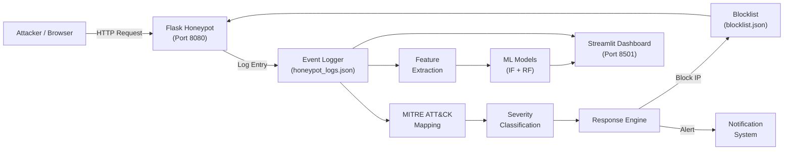
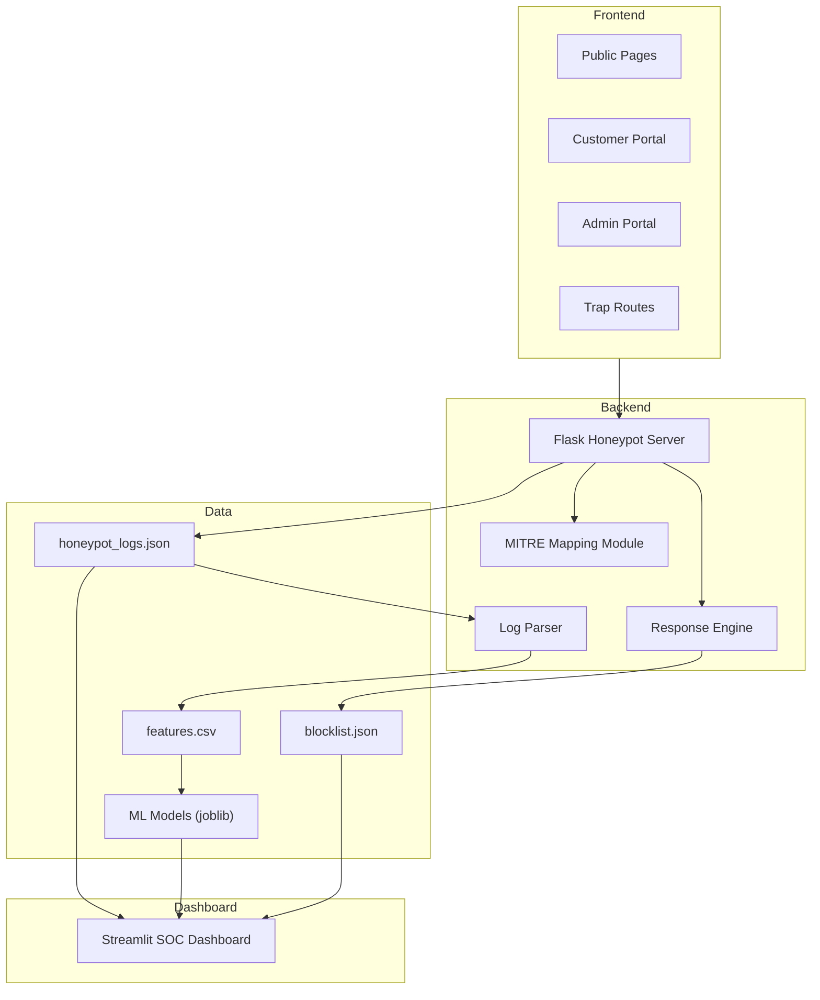
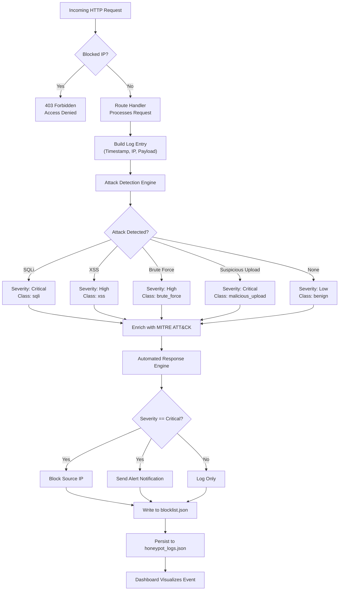

# 🛡️ Honeypot-Based Threat Detection & SOC Monitoring Dashboard


> A honeypot-driven cybersecurity monitoring platform that captures malicious activity, maps it to **MITRE ATT&CK** techniques, applies severity classification, performs automated response actions, and visualizes threat intelligence through a **SOC-style dashboard**. The system presents itself as a legitimate corporate website (*SecureCorp*), while silently logging and analyzing all visitor interactions using both rule-based pattern matching and machine learning models.

---

## 📑 Table of Contents

- [Key Features](#-key-features)
- [System Architecture](#-system-architecture)
- [Detection and Response Flow](#-detection-and-response-flow)
- [Project Structure](#-project-structure)
- [How the System Works](#-how-the-system-works)
- [Dashboard Overview](#-dashboard-overview)
- [Technologies Used](#-technologies-used)
- [Security Design Philosophy](#-security-design-philosophy)
- [Setup and Usage](#-setup-and-usage)
- [Test Credentials](#-test-credentials)
- [License](#-license)

---

## ✨ Key Features

### 🕸️ Honeypot-Based Attack Capture

The platform operates a Flask web server that mimics a corporate cybersecurity website. It includes public-facing pages, a customer portal with login and file upload capabilities, an admin portal, and deliberately placed trap routes (such as `/admin-panel`, `/debug-console`, `/wp-admin`, `/phpmyadmin`, and `/.env`). Every HTTP request, form submission, login attempt, file upload, and navigation event is captured and persisted as structured JSON log entries.

### 🎯 Adversary Simulation for Validation

A dedicated adversary simulation module (`adversary_simulation/`) provides automated attack scripts that validate the detection pipeline:

| Simulation | File | Description |
|---|---|---|
| SQL Injection | `sqli_sim.py` | Sends crafted SQL payloads to test injection detection |
| Port Scanning | `port_scan_sim.py` | Simulates network reconnaissance activity |
| Brute Force | `brute_force_sim.py` | Executes rapid login attempts against portals |

### 🗺️ MITRE ATT&CK Mapping

Every detected attack event is automatically enriched with a MITRE ATT&CK mapping via `mitre_mapping.py`. This assigns a **Technique ID** (e.g., T1190, T1110), **Technique Name**, and **Tactic** category to each event. The mapping standardizes threat classification and enables analysts to correlate observed behavior with known adversary tradecraft.

### ⚠️ Severity Classification

Events are classified into four severity levels:

| Severity | Trigger Examples |
|---|---|
| 🟢 **Low** | Normal page views, benign browsing |
| 🔵 **Medium** | Admin login attempts |
| 🟠 **High** | Trap route hits, XSS payloads |
| 🔴 **Critical** | SQL injection, malicious uploads, `.env` probes |

### 🚫 Automated IP Blocking

The response engine (`response_engine.py`) implements an automated blocking mechanism. When an event is classified as **Critical**, the source IP is immediately added to a persistent blocklist (`logs/blocklist.json`). A `before_request` middleware hook checks every incoming request against this blocklist and returns a **403 Forbidden** response for blocked addresses.

### 🔔 Alert Notification System

Critical security events trigger an alert pipeline that supports multiple notification backends. The architecture supports pluggable notification channels including **Telegram Bot API** and **SMTP email**, configurable through environment variables.

### 📊 SOC-Style Dashboard

A Streamlit-based Security Operations Center dashboard provides real-time visibility into all honeypot telemetry. Features include:

- Interactive **Plotly** charts
- Global attack map powered by **Folium**
- KPI summary cards
- Structured event tables with expandable detail views
- Data export capabilities
- ML-powered predictive analytics (Isolation Forest + Random Forest)

### 🌍 Interactive Global Attack Map

The Attack Map tab renders a dark-themed world map with geolocation markers for each attacking IP. Markers are **color-coded by severity** and **sized proportionally** to attempt count. Popup overlays display detailed attack context including IP address, country, city, attack type, MITRE technique, and attempt count.

---

## 🏗️ System Architecture





---

## 🔄 Detection and Response Flow



---

## 📁 Project Structure

```
isproject-main/
│
├── honeypot.py                  # Flask honeypot server (port 8080)
├── dashboard.py                 # Streamlit SOC dashboard (port 8501)
├── log_parser.py                # Feature extraction from raw logs
├── train_models.py              # ML model training pipeline
├── predict_service.py           # Real-time prediction monitor
├── simulate_traffic.py          # Synthetic traffic generator
├── mitre_mapping.py             # MITRE ATT&CK technique enrichment
├── response_engine.py           # Automated blocking and alert engine
├── geo_lookup.py                # IP geolocation resolution
├── requirements.txt             # Python dependencies
├── README.md                    # Project documentation
│
├── adversary_simulation/        # Automated attack validation scripts
│   ├── __init__.py              # Module initializer
│   ├── sqli_sim.py              # SQL injection attack simulation
│   ├── port_scan_sim.py         # Port scanning simulation
│   └── brute_force_sim.py       # Brute force login simulation
│
├── templates/                   # Jinja2 HTML templates (SecureCorp website)
│   ├── base.html                # Base template with navigation and JS logging
│   ├── index.html               # Public landing page
│   ├── services.html            # Services page
│   ├── about.html               # About page
│   ├── blog.html                # Blog page
│   ├── careers.html             # Careers page
│   ├── contact.html             # Contact form
│   ├── login.html               # Generic login page
│   ├── register.html            # Registration form
│   ├── forgot-password.html     # Password reset form
│   ├── customer_login.html      # Customer portal login
│   ├── customer_dashboard.html  # Customer portal dashboard
│   ├── admin_login.html         # Admin portal login
│   └── admin_dashboard.html     # Admin portal dashboard
│
├── logs/                        # Persistent data storage
│   ├── honeypot_logs.json       # Event log store (JSONL format)
│   ├── blocklist.json           # Blocked IP registry
│   └── features.csv             # Extracted ML features
│
├── models/                      # Serialized ML models
│   ├── isolation_forest.joblib  # Anomaly detection model
│   └── rf_attack_classifier.joblib  # Attack classification model
│
└── uploads/                     # Uploaded file evidence store
```

| Directory | Purpose |
|---|---|
| `adversary_simulation/` | Automated attack scripts for validating detection rules and stress-testing the honeypot |
| `templates/` | Jinja2 HTML templates rendering the honeypot website (public pages, customer & admin portals) |
| `logs/` | Persistent storage for event logs, ML feature exports, and the IP blocklist |
| `models/` | Serialized scikit-learn models trained on extracted log features for real-time classification |
| `uploads/` | Evidence collection directory for all user-uploaded files |

---

## ⚙️ How the System Works

### Step 1: Honeypot Captures Activity

The Flask application runs on port **8080** and serves a multi-page corporate website. Every incoming HTTP request triggers the logging pipeline. The `build_log` function constructs a standardized log entry containing the timestamp, source IP, HTTP method, endpoint path, request headers, query parameters, form data, and raw body payload (capped at 2 KB).

### Step 2: Event is Logged and Analyzed

The attack detection engine scans the assembled payload text against:

- **15** SQL injection patterns (compiled regex)
- **9** cross-site scripting patterns (compiled regex)
- **Brute force detection** — tracks login attempts per IP within a sliding 5-minute window
- **File upload inspection** — checks for suspicious extensions (`.exe`, `.bat`, `.sh`, `.php`, `.jsp`, `.asp`, `.cmd`, `.ps1`, `.py`) and content patterns (`<script>`, `<?php`, `#!/`, `import os`, `exec()`, `eval()`)

### Step 3: MITRE ATT&CK Enrichment

Detected attacks are passed through the MITRE mapping module, which assigns a **Technique ID**, **Technique Name**, and **Tactic** category. For example:

| Attack Type | MITRE Technique | Tactic |
|---|---|---|
| SQL Injection | T1190 — Exploit Public-Facing Application | Initial Access |
| Brute Force | T1110 — Brute Force | Credential Access |
| XSS | T1059.007 — JavaScript | Execution |

### Step 4: Severity Classification

Each event receives a severity level based on its characteristics. The severity level determines both dashboard prioritization and whether automated response actions are triggered.

### Step 5: Automated Response

When an event is classified as **Critical**, the response engine automatically adds the source IP to the persistent blocklist. Subsequent requests from blocked IPs are intercepted by the `before_request` middleware and rejected with a **403** status code. The blocking action triggers an alert notification containing full event context.

### Step 6: Dashboard Visualizes Telemetry

The Streamlit dashboard reads the log store directly, extracts ML features, runs predictions through the **Isolation Forest** (anomaly detection) and **Random Forest** (attack classification) models, and renders interactive visualizations with real-time refresh and export capabilities.

---

## 📊 Dashboard Overview

### Overview Tab

Displays five KPI cards summarizing the current threat posture:
- **Attacks Today** · **Critical Alerts** · **Unique Attacker IPs** · **Blocked IPs** · **Most Frequent Attack Type**

Below the KPIs: Attacks Over Time line chart, Severity Distribution donut chart, Attack Type Distribution donut, and Event Type Breakdown bar chart.

### Attack Map Tab

Interactive dark-themed world map (Folium + CartoDB Dark Matter tiles) with severity-coded markers. Includes **Top 10 Attacker IPs** and **Top 10 Attacking Countries** bar charts.

### MITRE & Threat Analysis Tab

- Technique Distribution bar chart
- Attack Type Distribution donut
- Tactic Breakdown chart (Initial Access, Credential Access, Execution, etc.)
- Most Targeted Services chart
- Detail table with technique ID, name, tactic, attack type, severity, and source IP

### Incidents Tab

Structured event investigation interface with four sub-tabs:

| Sub-Tab | Content |
|---|---|
| **All Events** | Sortable table with expandable detail rows |
| **Attacks** | Confirmed SQLi, XSS, and malicious upload events |
| **Traps** | Trap route access attempts |
| **Uploads** | File upload events with suspicion flags |

### Response Tab

- Current IP blocklist table
- Auto-Response Log for Critical events
- Color-coded Alert History cards (High & Critical severity)

---

## 🛠️ Technologies Used

| Category | Technology |
|---|---|
| **Backend Framework** | Flask |
| **Dashboard Framework** | Streamlit |
| **Machine Learning** | scikit-learn (Isolation Forest, Random Forest) |
| **Model Serialization** | joblib |
| **Data Processing** | pandas |
| **Interactive Charts** | Plotly |
| **Geospatial Mapping** | Folium, streamlit-folium |
| **IP Geolocation** | Custom `geo_lookup` module |
| **Threat Intelligence** | MITRE ATT&CK Framework (custom mapping) |
| **HTTP Client** | Requests (adversary simulation) |
| **Template Engine** | Jinja2 (Flask built-in) |
| **Data Storage** | JSON Lines (logs), JSON (blocklist), CSV (features) |
| **Language** | Python 3.8+ |

---

## 🔒 Security Design Philosophy

### Why Honeypots?

Honeypots provide a controlled environment where **all observed activity is inherently suspicious**, eliminating noise from production monitoring. By mimicking a real corporate website with login portals, file upload capabilities, and deliberately exposed administrative endpoints, the system attracts and captures authentic attack behavior — producing high-fidelity threat intelligence without risking production assets.

### Why MITRE ATT&CK?

The MITRE ATT&CK framework provides a **universally recognized taxonomy** for categorizing adversary behavior. Mapping detected attacks to specific Technique IDs and Tactics enables analysts to correlate honeypot observations with documented threat actor campaigns, facilitating communication between security teams and supporting threat hunting workflows.

### Why Automated Response?

Manual incident response introduces latency between detection and containment. Automated IP blocking ensures that Critical severity events trigger **immediate containment** (milliseconds, not minutes). The persistent blocklist and middleware-layer enforcement maintain blocking state across application restarts while preserving full audit trails.

### Why Visualization?

SOC analysts process large volumes of heterogeneous event data under time pressure. The multi-tab dashboard separates **operational summary**, **geospatial context**, **adversary technique analysis**, **detailed investigation**, and **response management** into dedicated workspaces — enabling rapid triage, pattern identification, and prioritized response.

---

## 🚀 Setup and Usage

### Prerequisites

- **Python 3.8** or later
- `pip` package manager

### 1️⃣ Clone the Repository

```bash
git clone https://github.com/<your-username>/isproject-main.git
cd isproject-main
```

### 2️⃣ Install Dependencies

```bash
pip install -r requirements.txt
```

### 3️⃣ Start the Honeypot Server

```bash
python honeypot.py
```

> The Flask server starts on `http://localhost:8080`. All visitor interactions are logged to `logs/honeypot_logs.json`.

### 4️⃣ Generate Training Data

```bash
python simulate_traffic.py
```

> Sends a mix of benign and malicious traffic: normal browsing, login attempts, SQL injection payloads, XSS payloads, brute force sequences, and trap route probes.

### 5️⃣ Run Adversary Simulations *(Optional)*

```bash
python adversary_simulation/sqli_sim.py
python adversary_simulation/brute_force_sim.py
python adversary_simulation/port_scan_sim.py
```

### 6️⃣ Parse Logs & Train ML Models

```bash
python log_parser.py
python train_models.py
```

> Produces `logs/features.csv`, `models/isolation_forest.joblib`, and `models/rf_attack_classifier.joblib`.

### 7️⃣ Launch the SOC Dashboard

```bash
python -m streamlit run dashboard.py
```

> Dashboard accessible at `http://localhost:8501`. Reads logs from disk and applies both rule-based and ML-based analysis in real time.

### 8️⃣ Real-Time Prediction Monitor *(Optional)*

```bash
python predict_service.py
```

> Streams live ML predictions for incoming log entries to the console.

---

## 🔑 Test Credentials

> **⚠️ Note:** These are honeypot credentials for controlled testing. All login attempts are captured, analyzed for attack patterns, and logged with full request context.

### Customer Portal (`/customer/login`)

| Username | Password |
|---|---|
| `demo` | `demo123` |
| `customer@securecorp.com` | `SecurePass123` |

### Admin Portal (`/admin/login`)

| Username | Password |
|---|---|
| `admin@securecorp.com` | `AdminSecure!456` |

---

## 📄 License

This project was developed for **educational and research purposes** in cybersecurity threat detection, honeypot design, and security operations center tooling.

---

<p align="center">
  Made with ❤️ for Cybersecurity Research
</p>
